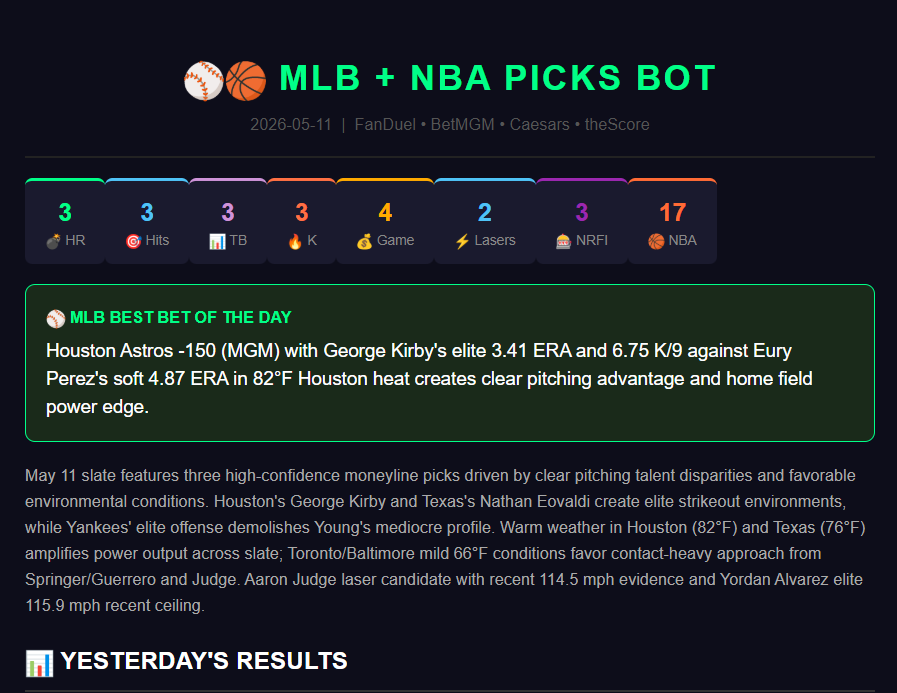

# ⚾🏀 Prop Intelligence Bot


-8A2BE2)


A daily automated sports prop betting intelligence pipeline covering MLB and NBA. Scrapes player props, fetches live odds, applies a quality-over-quantity filter, and delivers AI-scored picks with bull/bear rationale via email — every day, fully automated.

> Built around a core philosophy: **2 high-confidence picks per sport beats 10 mediocre ones.** The pipeline enforces an odds filter (-130 to +125) and selects only the strongest signals, synthesized by Claude AI into plain-English reasoning.

---

## 📬 Sample Output



*Daily email digest — top 2 MLB + NBA props with AI rationale, confidence tiers, and key factors*

---

## ⚙️ How It Works

```
[PropFinder Scraper] → [Odds API] → [News Fetcher] → [Claude AI Analyzer] → [Email Digest]
         ↓                                                      ↓
   [SQLite Database] ←————————————————————— [Grader (next-day results)]
```

The pipeline runs daily via GitHub Actions:
1. **Scraper** — pulls player props, NRFI/YRFI data, exit velo, projections, and NBA stats via Playwright
2. **Odds Fetcher** — fetches live MLB + NBA odds and player prop lines from The Odds API
3. **News Fetcher** — pulls relevant headlines via NewsAPI for context
4. **Analyzer** — Claude AI synthesizes all signals into ranked picks with confidence tiers, key factors, and bull/bear cases
5. **Emailer** — delivers a formatted HTML digest with top 2 picks per sport
6. **Grader** — next-day script that grades previous picks against actual results and logs to SQLite

---

## 🏆 Pick Selection Philosophy

| Filter | Rule |
|--------|------|
| Odds range | -130 to +125 only (avoids heavy favorites and longshots) |
| Picks per sport | Max 2 per day (quality over quantity) |
| Confidence tiers | Elite / High / Medium |
| NRFI | Separate pipeline with pitcher streak + team NRFI % |

---

## 🛠️ Tech Stack

- **Scraping:** Playwright (PropFinder), requests (MLB Stats API, ESPN API)
- **Odds:** The Odds API (MLB + NBA player props, spreads, totals)
- **News:** NewsAPI.org
- **AI:** Claude (Anthropic) — pick analysis, NRFI scoring, NBA prop rationale
- **Storage:** SQLite — picks history, grading results, P&L tracking
- **Delivery:** Gmail SMTP with HTML email templates
- **Automation:** GitHub Actions (daily cron)
- **Result Grading:** MLB Stats API + ESPN NBA API with fuzzy player name matching

---

## 📁 Project Structure

```
prop-intelligence-bot/
├── main.py              # Pipeline orchestrator
├── scraper.py           # Playwright scraper (PropFinder MLB + NBA)
├── odds_fetcher.py      # The Odds API integration
├── news_fetcher.py      # NewsAPI headlines
├── analyzer.py          # Claude AI MLB pick analysis + NRFI pipeline
├── nba_analyzer.py      # Claude AI NBA prop analysis
├── emailer.py           # HTML email builder + Gmail delivery
├── grader.py            # Next-day result grader (MLB Stats + ESPN)
├── database.py          # SQLite schema + query helpers
├── parser.py            # Data parsing utilities
├── check_db.py          # DB inspection utility
├── data/                # SQLite database (gitignored)
├── logs/                # Daily pick logs (gitignored)
└── .github/workflows/   # GitHub Actions daily cron
```

---

## 🚀 Setup

### 1. Clone & Install
```bash
git clone https://github.com/Obi-DataEng/prop-intelligence-bot.git
cd prop-intelligence-bot
pip install -r requirements.txt
playwright install chromium
```

### 2. Configure Environment Variables
Create a `.env` file with the following:

| Variable | Description |
|----------|-------------|
| `ANTHROPIC_API_KEY` | Claude AI for pick analysis |
| `ODDS_API_KEY` | The Odds API for live lines |
| `NEWS_API_KEY` | NewsAPI.org for headlines |
| `PROPFINDER_PASSWORD` | PropFinder login credentials |
| `GMAIL_USER` | Gmail sender address |
| `GMAIL_APP_PASSWORD` | Gmail app password (not regular password) |

### 3. Run Manually
```bash
python main.py          # Run full daily pipeline
python grader.py        # Grade previous day's picks
python check_db.py      # Inspect SQLite database
```

### 4. Deploy to GitHub Actions
Add all `.env` values as **GitHub Secrets** (Settings → Secrets → Actions). The workflow in `.github/workflows/` fires automatically on your configured schedule.

---

## 📈 Status

- ✅ **108 commits** — actively developed and iterated
- ✅ MLB + NBA pipelines both live
- ✅ NRFI/YRFI dedicated pipeline with pitcher streak tracking
- ✅ Automated result grading with fuzzy player name matching
- ✅ Quality-over-quantity filter enforced at pipeline level

---

## 🗺️ Roadmap

| Phase | Status | Feature |
|-------|--------|---------|
| ✅ Phase 1 | Live | MLB props + NRFI pipeline |
| ✅ Phase 2 | Live | NBA props + dual-sport email digest |
| 🔜 Phase 3 | Planned | WNBA pipeline |
| 🔜 Phase 4 | Planned | Bankroll tracker + ROI dashboard |
| 🔜 Phase 5 | Planned | Backtesting engine for strategy validation |

---

## ⚠️ Disclaimer

This tool is for educational and personal research only. Not financial advice. Sports betting carries risk — never wager more than you can afford to lose.